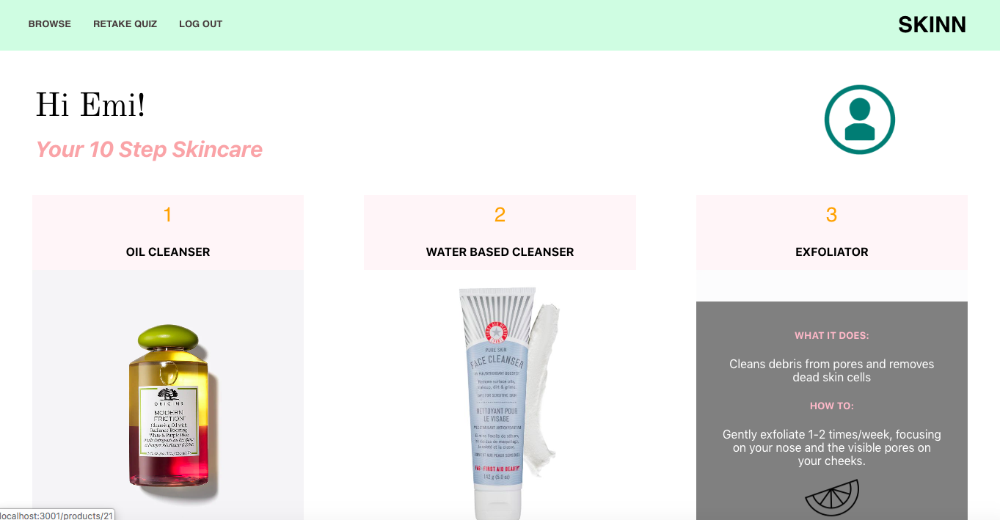
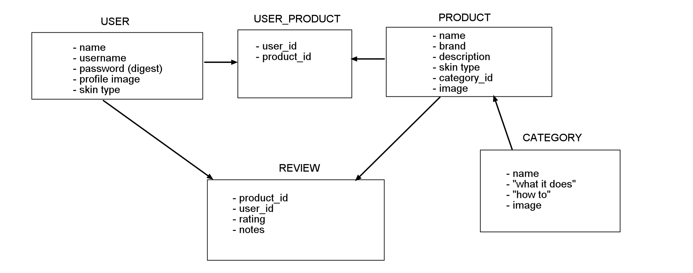

# SKINN App
------
**Final Project for [Flatiron School](https://flatironschool.com/) Module 4 (React.js)**

## PROJECT DESCRIPTION

### Goal
Building an application where women can share their 10 Step Skincare routine. With so many products out there, it can get overwhelming to choose what is right for you. SKINN (Skin-Natural) makes it easier for women to share the products they are using for each step, their reviews and thoughts on the items, and to explore other natural, organic products based on their skin type. It’s a platform for women to give a peak inside their shelf tops.

### Instructions 
1. On backend, (skinn-app-api) bundle install before running rails server (rails s) on the terminal.
2. On frontend, (skinn-app-frontend) npm install before runnning npm start on the terminal. 

### Functions 
SKINN is built using React.js for the frontend, and Rails as our backend API server. The frontend uses a simple Bcrypt authentication. Client-side routes implemented using react-router. 
Main Components:
* **Main Container**: shows the 10-step skincare products pertaining to the current user. By clicking on the item (StepCard component), the user can view more details on the product, as well as choose to browse more products within the relative category. 
* **Browse Container**: lists products per category. By clicking on the item (StepCard component, reused from Main Container), the user can "PICK" the item to swap out with their current product. 
* **Product Page**: shows individual product brand, description, and review form. Once review is submitted, our Review Card component renders the review beneath the product details. 
* **Quiz Page**: the user answers the question on the quiz page component, and the application will customize the 10-step product selection based on the answer provided. The user may retake the quiz as many times as needed. 

## PROJECT REQUIREMENTS

1. Use a Rails API backend with a separate React frontend.
2. Have at least three resources on the backend and your application must have full CRUD actions for at least one resource.
3. Must have at least two different client-side routes (i.e. use react-router). Ex: even if your whole app is mostly a single page app, have the form to signup be found at /signup
4. Optional: Your application can have authentication/authorization. You are welcome to use an auth template as discussed in class.

**Time allocated: 5 days**

## MODEL FLOW CHART

### Collaborator:
[@cbatsoula](https://github.com/cbatsoula)
